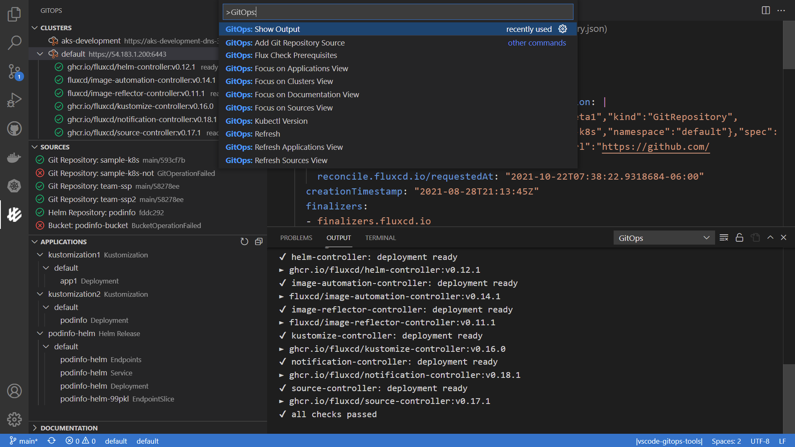
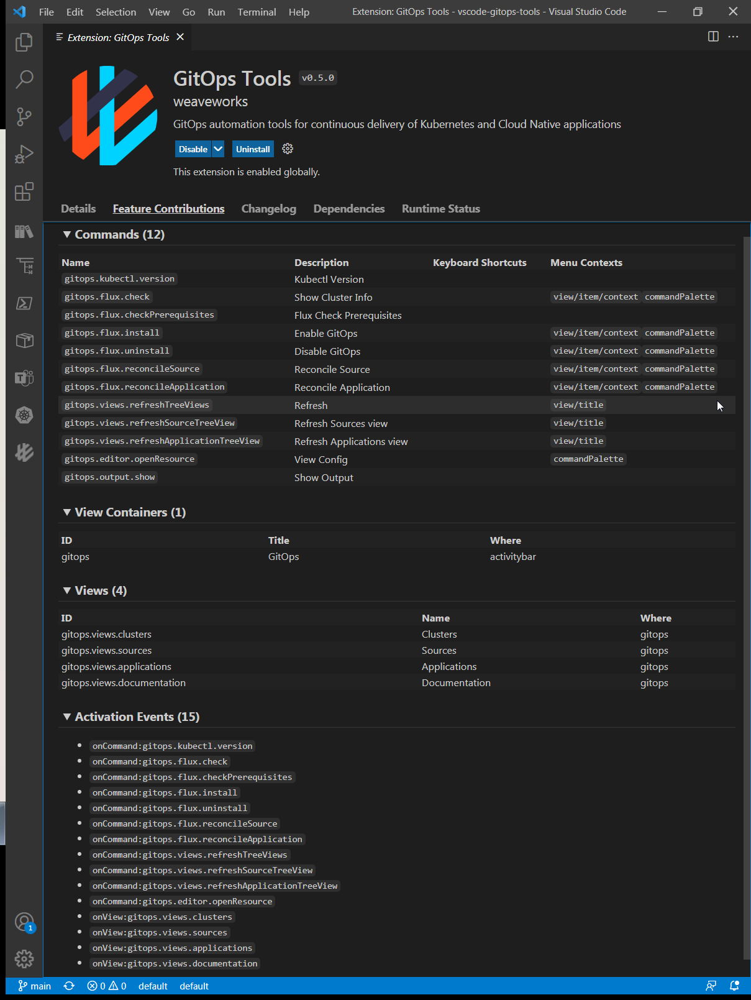

# vscode-gitops-tools

<h1 align="center">
  <br />
    
  <br />
  GitOps Tools for Visual Studio Code
  <br />
  <br />
</h1>

GitOps extension provides integration with [Kubernetes Tools](https://marketplace.visualstudio.com/items?itemName=ms-kubernetes-tools.vscode-kubernetes-tools) and [`kubectl`](https://kubernetes.io/docs/reference/kubectl/overview/) CLI to view Kubernetes Clusters, Sources, and Application deployments in Visual Studio Code IDE.


# Features

- Access to custom GitOps sidebar
- Use integrated `gitops` terminal
- View GitOps Output panel with CLI command traces for diagnostics
- View configured Kubernetes Clusters from `kubectl`
- Enable/Disable GitOps Cluster operations support
- View [GitOps Toolkit components](https://fluxcd.io/docs/components/), version info, and deployment status for the GitOps enabled clusters and Flux controllers
- View Git/Helm Repositories and Bucket Sources info for the selected cluster
- View Application Kustomizations and Helm Releases for the selected cluster
- Reconcile Sources and Application deployments on demand
- Preview short Kubernetes Object info in rich markdown table tooltips on hover for the loaded Clusters, Sources, and Applications
- Load Kubernetes Object manifest `.yaml` configs in vscode editor via [Kubernetes Tools API](https://github.com/Azure/vscode-kubernetes-tools-api) and virtual Kubernetes file system provider
- Open [GitOps](https://www.weave.works/technologies/gitops/) Documentation links to [Flux](https://fluxcd.io/) and [Wego](https://www.weave.works/product/gitops-core/) CLI top level topics in your default web browser

# Dependencies

GitOps extension depends on [Kubernetes Tools](https://marketplace.visualstudio.com/items?itemName=ms-kubernetes-tools.vscode-kubernetes-tools) extension which is automatically installed with this extension for building apps to run with Kubernetes clusters or troublishooting Kubernetes cluster applications. You may need to invoke the following command line tools, depending on which features you use. You will need `kubectl`, `helm`, and `flux` CLI at the minimum to use this GitOps extension and its Kubernetes cluster management operations.

Tool | Description | Installation
--- | --- | ---
[`kubectl`](https://kubernetes.io/docs/reference/kubectl/overview/) | The kubectl command line tool lets you control Kubernetes clusters.  | [Install Kubectl](https://kubectl.docs.kubernetes.io/installation/kubectl/)
[`helm`](https://helm.sh) | The package manager for Kubernetes. | [Install Helm](https://helm.sh/docs/intro/install/)
[`flux`](https://fluxcd.io) | Flux is a set of continuous and progressive delivery solutions for Kubernetes. | [Install Flux](https://fluxcd.io/docs/installation/)

Optional tools:

Tool | Description | Installation
--- | --- | ---
[`az`](https://docs.microsoft.com/en-us/cli/azure/) | Azure CLI. (only if using the extension to create or register Azure clusters) | [Install az](https://docs.microsoft.com/en-us/cli/azure/install-azure-cli)
[`minikube`](https://minikube.sigs.k8s.io/docs/) | minikube is local Kubernetes, focusing on making it easy to learn and develop for Kubernetes. (only if you want to use it) | [Install minikube](https://minikube.sigs.k8s.io/docs/start/)
[`git`](https://git-scm.com) | Git is a free and open source distributed version control system. (only if using the `sync working copy to repository` feature) | [Install git](https://git-scm.com/downloads)
[`docker`](https://www.docker.com) | Docker is an open platform for developing, shipping, and running applications. | [Install Docker](https://docs.docker.com/get-docker/)


We recommend you install these CLI tools on your system PATH before using GitOps extension. If these tools aren't on your system `PATH`, then some commands may not work. If the extension needs one of the core Kubernetes tools and they are missing, it will prompt you to install them.

# GitOps Commands

You can access GitOps tools check, CLI dependendency versions, Clusters, Sources and Applications views Focus and Refresh commands by typing `GitOps` in `View -> Command Palette...` menu prompt:



# GitOps Feature Contributions

GitOps extension contributes the following Commands, View Containers, Views, and Activation Events to VSCode IDE for working with GitOps Kubernetes clusters:



# Dev Build

Use the following commands to build GitOps vscode extension locally for testing, debugging, and submitting pull requests (PRs):

```
$ git clone https://github.com/weaveworks/vscode-gitops-tools
$ cd vscode-gitops-tools
$ npm install
$ npm run compile
$ code .
```

Watch for changes:

```
$ npm run-script watch
```

Press `F5` in VSCode to start GitOps extension debug session.

# Packaging and Installation

VSCode extensions are packaged and published with [`vsce`](https://code.visualstudio.com/api/working-with-extensions/publishing-extension) commnand line tool. Use the following steps to create GitOps extension `.vsix` package for local testing or publishing to [VSCode Marketplace](https://marketplace.visualstudio.com/vscode):

1. Install [Node.js](https://nodejs.org)
2. Install [vsce](https://github.com/microsoft/vscode-vsce): ```$ npm install -g vsce```
3. Package GitOps extension: ```$ vsce package```
4. Follow [Install from VSIX](https://code.visualstudio.com/docs/editor/extension-marketplace#_install-from-a-vsix) instructions to install the resulting `vscode-gitops-tools-0.x.0.vsix` extension package in vscode for local testing.

Install from `.vsix` file step is only required for testing the latest version of GitOps extension. Devs and DevOps will be able to download and install it from [VSCode Marketplace](https://marketplace.visualstudio.com/search?term=gitops&target=VSCode) when this vscode extension MVP is released and published.
